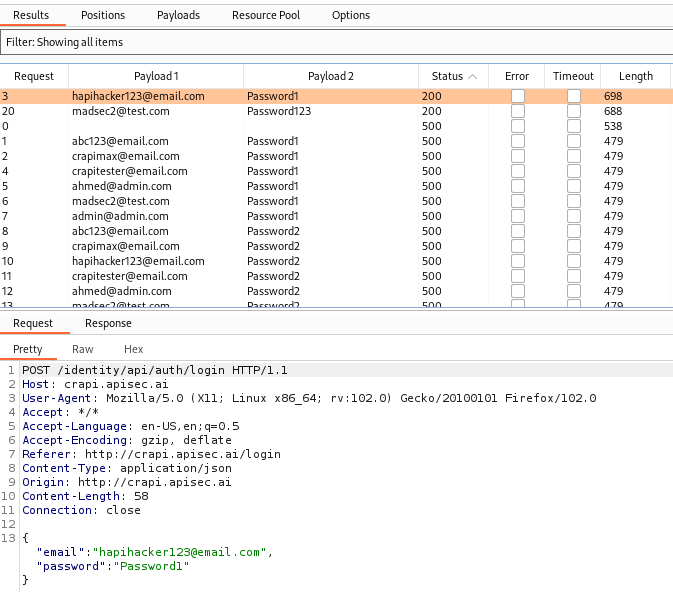

# API2:2023 — Broken Authentication

## Intro
**API2:2023 Broken Authentication** refers to any weakness within the API authentication process. All APIs that contain sensitive information should have some mechanism to authenticate users. Authentication is the process used to verify the identity of an API user, whether that user is a person, device, or system. In other words, authentication verifies that an entity is who it claims to be. This verification process is normally done using a username and password, token, and/or multi-factor authentication (MFA).

Authentication-related vulnerabilities typically occur when an API provider either:
- Does not implement a strong authentication mechanism, or  
- Implements the authentication process incorrectly.

---

## OWASP Attack Vector Description
The authentication mechanism is an easy target for attackers since it's exposed to everyone. Although more advanced technical skills may be required to exploit some authentication issues, exploitation tools are generally available.

---

## OWASP Security Weakness Description
Software and security engineers’ misconceptions regarding authentication boundaries and inherent implementation complexity make authentication issues prevalent. Methodologies of detecting broken authentication are available and easy to create.

---

## OWASP Impacts Description
Attackers can gain complete control of other users’ accounts in the system, read their personal data, and perform sensitive actions on their behalf. Systems are unlikely to be able to distinguish attackers’ actions from legitimate user ones.

---

## Summary
Broken Authentication continues to be a significant security issue due to poor password policies, weak authentication mechanisms, and misconfigurations. API authentication is a complex process that is commonly found with most APIs and is necessarily exposed. The impact of broken authentication can lead to an attacker taking control of user accounts, compromising personal data, and conducting sensitive actions (for example, editing healthcare data). Authentication is often one of the first lines of defense for APIs, and when this mechanism is vulnerable, it can lead to a data breach.

--- 

## Weak Password Policy
A weak password policy does not sufficiently protect user accounts by enforcing strong password creation and management.

Common weaknesses include:
- Allows users to create simple passwords
- Allows brute force attempts against user accounts
- Allows users to change their password without asking for password confirmation
- Allows users to change their account email without asking for password confirmation
- Discloses token or password in the URL
- GraphQL queries allow for many authentication attempts in a single request
- Lacking authentication for sensitive requests

---

## Credential Stuffing
Credential stuffing is a type of attack against authentication where a large number of username and password combinations are attempted. Credentials used in these types of attacks are typically collected from data breaches.

Common weakness:
- Allows users to brute force many username and password combinations

---

## Predictable Tokens
Predictable tokens refer to any token obtained through a weak token generation authentication process. Weak tokens can easily be guessed, deduced, or calculated by an attacker.

Common weakness:
- Using incremental or guessable token IDs

---

## Misconfigured JSON Web Tokens
JSON Web Tokens (JWTs) are commonly used for API authentication and authorization processes. JWTs provide developers with flexibility to customize:
- The signing algorithm
- The key/secret used for signing
- The payload contents

This customization also creates room for security misconfigurations.

Common misconfigurations include:
- API provider accepts unsigned JWT tokens
- API provider does not check JWT expiration
- API provider discloses sensitive information within the encoded JWT payload
- JWT is signed with a weak key

---

## Why Authentication Breaks (Context)
API authentication can be a complex system that includes several processes with a lot of room for failure. As security expert Bruce Schneier said:

> “the future of digital systems is complexity and complexity is the worst enemy of security”.

From the six constraints of REST APIs, RESTful APIs are designed to be **stateless**. To be stateless, the API provider shouldn’t need to remember the consumer from one request to another. For this constraint to work, APIs often require users to undergo a registration process to obtain a unique token. The token generated is then used in subsequent requests for authentication and authorization.

As a consequence, the following areas can each introduce weaknesses:
- The registration process used to obtain an API token
- Token handling mechanisms
- The system that generates tokens

If the token generation process doesn’t rely on a high level of randomness (entropy), there is a chance that an attacker can create their own token or hijack another user's token.

Other authentication processes that may introduce vulnerabilities include registration-related flows such as:
- Password reset
- Multi-factor authentication (MFA)

### Example: Weak Password Reset
Imagine a password reset feature requiring an email address and a **six-digit code** to reset your password. If the API allows unlimited attempts, an attacker would only need to make **one million** requests to guess the code and reset any user’s password. A **four-digit** code would require only **ten thousand** requests.

---

## OWASP Preventative Measures

- Make sure you know all the possible flows to authenticate to the API (mobile/web/deep links that implement one-click authentication/etc.). Ask your engineers what flows you missed.
- Read about your authentication mechanisms. Make sure you understand what and how they are used. OAuth is not authentication, and neither are API keys.
- Don't reinvent the wheel in authentication, token generation, or password storage. Use the standards.
- Credential recovery/forgot password endpoints should be treated as login endpoints in terms of brute force, rate limiting, and lockout protections.
- Require re-authentication for sensitive operations (e.g. changing the account owner email address/2FA phone number).
- Use the OWASP Authentication Cheat Sheet:  
  https://cheatsheetseries.owasp.org/cheatsheets/Authentication_Cheat_Sheet.html
- Where possible, implement multi-factor authentication (MFA).
- Implement anti-brute force mechanisms to mitigate credential stuffing, dictionary attacks, and brute force attacks on your authentication endpoints. This mechanism should be stricter than the regular rate limiting mechanisms on your APIs.
- Implement account lockout/captcha mechanisms to prevent brute force attacks against specific users.
- Implement weak-password checks.
- API keys should not be used for user authentication. They should only be used for API clients authentication.

---

## Additional Resources

- CWE-204: Observable Response Discrepancy
- CWE-307: Improper Restriction of Excessive Authentication Attempts
- CWE-798: Use of Hard-coded Credentials
- Authentication Cheat Sheet
- Key Management Cheat Sheet
- Credential Stuffing
- Web Security Academy: Authentication
- Web Security Academy: JWT Attacks

