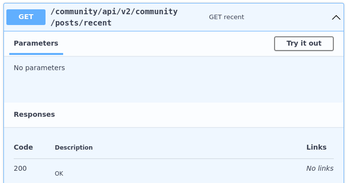

# API3:2023 — Broken Object Property Level Authorization (BOPLA)

## What it is (in simple terms)
**BOPLA** happens when an API fails to control access at the **field/property level** inside an object.

Even if a user is allowed to access an object (example: their own profile), they **should not automatically** be allowed to:
- **See every field** inside it (read problem), or
- **Change every field** inside it (write problem)

In OWASP API Security Top 10 (2023), **BOPLA combines two older (2019) issues**:
1. **Excessive Data Exposure** (too much data returned)
2. **Mass Assignment** (user can change sensitive fields)

---

## Two parts of BOPLA

### 1) Excessive Data Exposure (Read issue)
**Meaning:** The API returns the **entire object** instead of only the needed fields, which can expose sensitive info.

- Expected: API returns only what is requested/needed  
- Problem: API returns **extra sensitive properties** (e.g., SSN, salary, internal flags, tokens)

**Layman example:**  
You ask someone for their **name**, and they reply with their **name + DOB + phone + email + private notes**.

---

### 2) Mass Assignment (Write issue)
**Meaning:** The API allows user input to **update sensitive object properties** that the user should not be allowed to change.

Example sensitive properties:
- `role`, `isAdmin`, `accountStatus`, `creditLimit`, `salary`, `verified`, `discountRate`

If there are no restrictions, an attacker can:
- Elevate privileges (e.g., make themselves admin)
- Perform unauthorized admin-level actions

---

## Why OWASP combined them in 2023
Both issues are rooted in the same problem:
**“Object property level authorization validation failures.”**

In short: **authorization is missing at the field level**.

---

## OWASP Attack Vector (How attackers exploit it)
- Many APIs expose endpoints that return **all properties** of an object (common in REST).
- In GraphQL, attackers may craft queries to request extra properties.
- Attackers often:
  - Inspect responses to find sensitive fields
  - Use fuzzing to discover hidden properties
  - Try updating properties and observe changes (even if not returned in response)

---

## OWASP Security Weakness (Why it happens)
- Just reviewing API responses can reveal exposed sensitive data.
- Hidden fields are found by **fuzzing/testing**.
- To confirm if a property can be changed:
  - Craft a request (POST/PUT/PATCH)
  - Check response and side effects (sometimes the field isn’t shown back)

---

## OWASP Impact (What can go wrong)
Unauthorized access to object properties can lead to:
- **Data disclosure** (private info leak)
- **Data loss or corruption**
- **Privilege escalation**
- **Partial/full account takeover**

---

## When an API is considered vulnerable (OWASP criteria)
An API endpoint is vulnerable if:

1. It exposes **sensitive properties** that the user should **not be able to read**  
   *(Earlier: Excessive Data Exposure)*

2. It allows a user to **change/add/delete** a **sensitive property** they should **not be able to modify**  
   *(Earlier: Mass Assignment)*

---

## Quick interview-ready summary (1–2 lines)
**BOPLA is when an API doesn’t enforce authorization at the field/property level, causing sensitive fields to be exposed in responses (excessive data exposure) or allowing users to update restricted fields (mass assignment), leading to data leaks or privilege escalation.**


## BOPLA Vulnerabilities (OWASP)

An API endpoint is considered vulnerable to **BOPLA** if either of the following is true:

- The API endpoint **exposes properties of an object** that are considered sensitive and **should not be read** by the user.  
  *(Previously named: “Excessive Data Exposure”)*

- The API endpoint **allows a user to change, add, and/or delete** the value of a sensitive object's property which the user **should not be able to access**.  
  *(Previously named: “Mass Assignment”)*



## Mass Assignment

**Mass assignment** occurs when an API consumer includes **more parameters** in a request than the application intended, and the application blindly maps those parameters into internal objects/variables. This can allow a user to **edit sensitive properties** or **escalate privileges**.

### Why it’s dangerous (simple view)
An endpoint may be designed to let users update only basic fields like:
- username
- password
- address

But if the API also accepts extra fields like:
- privilege level
- account balance
- admin flags (e.g., `isAdmin`)

…and does **not validate against an allowlist (whitelist)** of permitted fields, a user can exploit it.

---

### Example
Imagine an API is called to create an account with parameters for `User` and `Password`:

```json
{
  "User": "hapi_hacker",
  "Password": "GreatPassword123"
}

While reading the API documentation, an attacker discovers an additional property, isAdmin, used by the provider to create administrative accounts. The attacker adds it and sets it to true

{
  "User": "hapi_hacker",
  "Password": "GreatPassword123",
  "isAdmin": true
}

If the API does not sanitize or restrict request input, it is vulnerable to mass assignment. The backend may map the extra key-value pair ("isAdmin": true) into the user object, making the user effectively an administrator.

---

## OWASP Preventative Measures (BOPLA)

- When exposing an object using an API endpoint, always make sure that the user should have access to the object's properties you expose.
- Avoid using generic methods such as `to_json()` and `to_string()`. Instead, cherry-pick specific object properties you specifically want to return.
- If possible, avoid using functions that automatically bind a client's input into code variables, internal objects, or object properties (**Mass Assignment**).
- Allow changes only to the object's properties that should be updated by the client.
- Implement a schema-based response validation mechanism as an extra layer of security. As part of this mechanism, define and enforce data returned by all API methods.
- Keep returned data structures to the bare minimum, according to the business/functional requirements for the endpoint.

---

## Additional Resources

- API3:2019 Excessive Data Exposure — OWASP API Security Top 10 2019
- API6:2019 Mass Assignment — OWASP API Security Top 10 2019
- Mass Assignment Cheat Sheet
- CWE-213: Exposure of Sensitive Information Due to Incompatible Policies
- CWE-915: Improperly Controlled Modification of Dynamically-Determined Object Attributes
