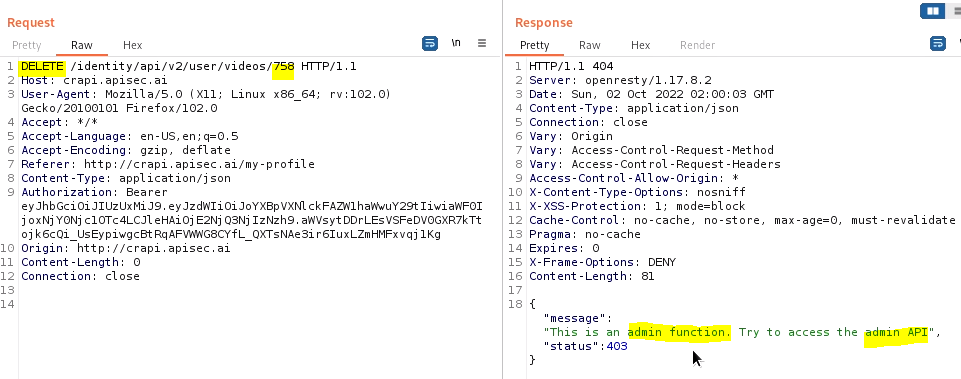
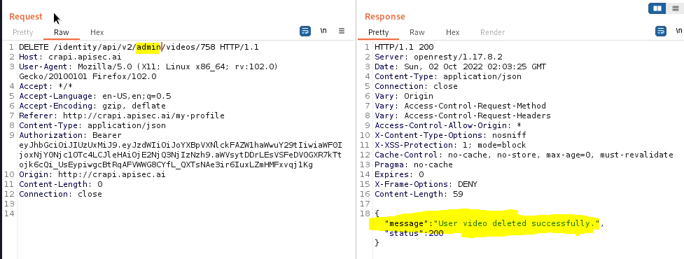

# API5:2023 – Broken Function Level Authorization (BFLA)

## Introduction

**Broken Function Level Authorization (BFLA)** is a vulnerability where API functions have insufficient access controls.  
While **BOLA (Broken Object Level Authorization)** is about unauthorized access to **data**, **BFLA** is about unauthorized **actions** such as creating, modifying, or deleting data.

In addition, a vulnerable API may allow an attacker to perform actions intended for other roles, including **administrative actions**.

### Simple Example

- **BOLA**:  
  A fintech API allows an attacker to **view another user’s bank account balance**.

- **BFLA**:  
  The same API allows an attacker to **transfer money from another user’s account to their own**.

---

## OWASP Attack Vector Description

Exploitation requires an attacker to send **legitimate API calls** to endpoints that they **should not be allowed to access** as:
- Anonymous users, or  
- Regular, non-privileged users  

If such endpoints are exposed without proper authorization checks, they can be **easily exploited**.

---

## OWASP Security Weakness Description

Authorization checks for functions or resources are typically managed via:
- Configuration, or  
- Code-level controls  

Implementing proper authorization is challenging because modern applications often include:
- Multiple roles  
- Groups  
- Complex user hierarchies (e.g., sub-users, multi-role users)

APIs make these flaws easier to discover because:
- APIs are highly structured  
- Functionality and endpoints are predictable  

---

## OWASP Impact Description

BFLA vulnerabilities allow attackers to:
- Access unauthorized functionality  
- Abuse administrative functions  

This may lead to:
- Data disclosure  
- Data loss  
- Data corruption  
- Service disruption  

---

## BFLA (Broken Function Level Authorization) Vulnerability

### What is BFLA?

- A **user with one privilege level** can access or execute **functionality meant for another user or role**.
- APIs commonly support **multiple privilege levels**, such as:
  - Public users
  - Merchants
  - Partners
  - Vendors
  - Administrators

---

### How BFLA Can Be Exploited

BFLA vulnerabilities can be abused for:

- **Unauthorized use of lateral functions**  
  (Accessing functions meant for another user or peer group)

- **Privilege escalation**  
  (Accessing functions meant for higher-privileged roles, such as admins)

---

### Commonly Targeted API Functions

Attackers typically target API endpoints that handle:

- **Sensitive information**
- **Resources owned by another group**
- **Administrative functionality**, such as:
  - User account management
  - Role or permission management
  - System configuration actions

---

### Key Takeaway

If an API allows users to perform actions **outside their assigned role or privilege level**, it is vulnerable to **Broken Function Level Authorization (BFLA)**.

---
## Testing for BFLA (Broken Function Level Authorization)

When testing for **Broken Function Level Authorization**, focus on identifying API endpoints that an attacker could misuse to their advantage.

### Key Areas to Test

Look for endpoints that allow:

- **Altering user accounts**  
  - Updating profile details
  - Changing roles or permissions
  - Resetting credentials

- **Deleting user resources**  
  - Removing accounts
  - Deleting data, records, or assets

- **Gaining access to restricted endpoints**  
  - Admin or management APIs
  - Endpoints intended only for privileged roles

---

### Testing Mindset

- Assume the attacker is a **valid authenticated user** with limited privileges.
- Test whether that user can:
  - Access endpoints meant for other roles
  - Perform actions beyond their authorization level
  - Invoke restricted

---

## Summary

**Broken Function Level Authorization (BFLA)** occurs when a user with one privilege level can access API functionality meant for:
- Another user  
- Another user group  
- A higher privilege level  

API providers often define multiple privilege levels, such as:
- Public users  
- Merchants  
- Partners  
- Vendors  
- Administrators  

### Common Exploitation Scenarios

- **Lateral access**:  
  A user accesses functions of another user group with similar privileges.

- **Privilege escalation**:  
  A user accesses functions reserved for a more privileged role.

### High-Risk API Functions

Attackers commonly target functions that:
- Alter user accounts  
- Delete resources  
- Manage users or permissions  
- Access sensitive or restricted resources  

---

## Endpoint-Based Authorization Issues

APIs may use different endpoints for different privilege levels.

### Example

- User endpoint:  
/{userid}/account/balance

- Admin endpoint:  

/admin/account/{userid}

If authorization checks are weak or missing, an attacker may:
- Access admin endpoints  
- Perform account takeover  
- Execute unauthorized administrative actions  

---

## HTTP Method-Based BFLA

Not all APIs use separate admin endpoints.

Sometimes, privilege is determined by **HTTP methods**, such as:
- GET  
- POST  
- PUT  
- DELETE  

If an API does not restrict which HTTP methods a user can invoke:
- Simply changing the HTTP method may expose a **BFLA vulnerability**

### Example

- Authorized method: `PUT`
- Attacker uses: `DELETE`

This could allow unauthorized deletion of resources.

---

## What to Look for When Testing BFLA

When testing for BFLA vulnerabilities, look for functionality that could be abused, including but not limited to:
- Modifying user accounts  
- Deleting user resources  
- Accessing restricted endpoints  
- Managing users or roles  

### Example Scenario

If an API allows **partners** to add users to the partner group but does not restrict this function:
- Any user could add themselves to **any group**
- Once added, the attacker may gain access to that group’s resources

---

## Key Takeaway

If a user can perform actions **outside their intended privilege level**, the API is vulnerable to **Broken Function Level Authorization (BFLA)**.

This request results in a telling response, "This is an admin function. Try to access the admin API". This would lead an attacker to try using an admin path in the DELETE request (/identity/api/v2/admin/videos/758).

## OWASP Preventative Measures

- Ensure the application has a **consistent and easy-to-analyze authorization module** that is invoked from **all business functions**.  
  - In many cases, this protection is provided by one or more components **external to the application code**.

- Implement **deny-by-default** access control.  
  - All access should be blocked unless **explicitly granted** to specific roles for each function.

- Review all API endpoints for **function-level authorization flaws**, keeping in mind:
  - Business logic
  - Role definitions
  - Group hierarchies

- Ensure that **all administrative controllers** inherit from an **administrative abstract controller** that:
  - Enforces authorization checks
  - Validates access based on the user’s **group and role**

- Ensure that **administrative functions within regular controllers** also:
  - Perform authorization checks
  - Validate the user’s **group and role**

---

## Additional Resources

- **CWE-285**: Improper Authorization  
- **Forced Browsing**  
- **A7: Missing Function Level Access Control**, OWASP Top 10 (2013)  
- **OWASP Community Guide for Access Control**

