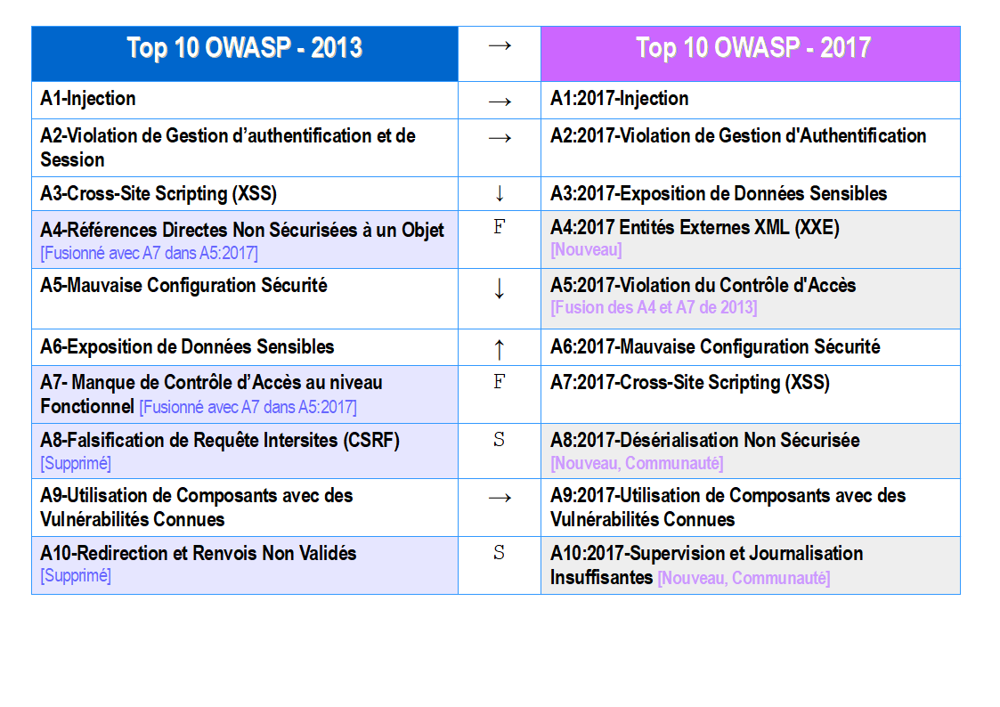

# RN Notes de version

## Ce qui a changé entre 2013 et 2017

Depuis quatre ans, les changements se sont accélérés, et le Top 10 de l'OWASP se devait d'en tenir compte. Nous avons complètement restructuré le Top 10 de l'OWASP, renouvelé la démarche, utilisé de nouvelles sources de données, travaillé avec la communauté, réorganisé les risques, réécrit chaque risque à partir de zéro, et ajouté des références aux environnements et aux langages communément utilisés.

Au cours des dernières années, les technologies de base et les architectures des applications ont évoluées de façon significative:

* Des microservices écrits en node.js et Spring Boot ont remplacés les traditionnelles applications monolithiques. Les microservices ont leurs propres enjeux de sécurité comme d'établir la confiance entre microservices, conteneurs, de gérer les secrets, etc. Du vieux code qui ne devait jamais être accessible depuis Internet se retrouve aujourd'hui derrière des API ou des web services RESTful appelé par des Applications Web Monopage ("Single-Page Application ou SPA") et des applications mobiles. Les hypothèses d'architecture du code, tels que des appelants de confiance, ne sont plus valables.
* Les Applications Web Monopage, écrites dans des environnements JavaScript comme Angular et React, permettent de créer des interfaces web utilisateur très modulaires et riches en fonctionnalités. Les fonctionnalités côté Client, traditionnellement délivrées par le serveur, apportent leurs propres enjeux de sécurité.
* JavaScript est aujourd'hui le premier langage web avec node.js côté Serveur et de nouveaux environnements logiciels web tels que Bootstrap, Electron, Angular, et React, côté Client.

## Nouvel élément, concernant les données

* **A4:2017-Entités Externes XML (XXE)** est une nouvelle catégorie soutenue essentiellement par des outils d'analyse sécurité de code source tels que ceux référencés dans ([SAST](https://www.owasp.org/index.php/Source_Code_Analysis_Tools)).

## Nouveaux éléments, relevés par la communauté

Nous avons interrogé la communauté pour avoir leur retour prospectif sur deux catégories de vulnérabilités. Après plus de 500 propositions de nos pairs, et la suppression des enjeux déjà pris en compte dans le cadre des données (tels que ceux de "Exposition de Données Sensibles" et "XXE"), nous avons retenu deux nouveaux enjeux: 

* **A8:2017-Désérialisation non Sécurisée**, qui permet l'exécution de code à distance ou la manipulation d'objects sensibles sur les plateformes concernées.
* **A10:2017-Supervision et Journalisation Insuffisantes**, l'insuffisance de prévention et de limitation des activités malveillantes et de détection des attaques, de réponse aux incidents, et d'analyses légales post-incident.

## Elements fusionnés ou supprimés, mais non oubliés

* **A4–Références directes non sécurisées à un objet** et **A7–Manque de contrôle d’accès au niveau fonctionnel** ont été fusionnés dans **A5:2017-Ruptures de Contrôles d'Accès**.
* **A8–Falsification de requête intersites (CSRF)**, a été supprimé car beaucoup d'environnements logiciel intègrent des [défenses CSRF](https://www.owasp.org/index.php/Cross-Site_Request_Forgery_(CSRF)), et que cela n'a été retrouvé que dans 5% des applications.
* **A10–Redirection et Renvois non validés**, a été supprimé, bien que cela ait été retrouvé dans 8% des applications, car cela est globalement supplanté par XXE.

