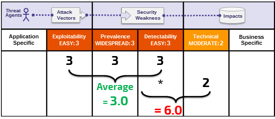

# + R Catatan Tentang Resiko

## Ini tentang Resiko yang Melihatkan Kelemahan

Metodologi Rating Resiko untuk Top 10 didasarkan pada Metodologi Penilaian Resiko OWASP. Untuk setiap kategori Top 10, kami memperkirakan resiko khas yang masing-masing kelemahan diperkenalkan pada aplikasi web biasa dengan melihat faktor kemungkinan umum dan faktor dampak untuk setiap kelemahan umum. Kami kemudian memesan untuk Top 10 sesuai dengan kelemahan yang biasanya mengenalkan resiko paling signifikan ke aplikasi. Faktor-faktor ini dapat diperbarui dengan setiap rilis, Top 10 terbaru saat berbagai hal berubah dan berkembang.

Metodologi Penilaian Resiko OWASP mendefinisikan banyak faktor untuk membantu menghitung resiko kerentanan yang teridentifikasi. Namun, untuk Top 10 harus berbicara tentang generalitas, bukan kerentanan spesifik dalam aplikasi dan API nyata. Akibatnya, kita tidak akan pernah setepat pemilik aplikasi atau manajer saat menghitung resiko penerapannya. Anda paling siap untuk menilai pentingnya aplikasi dan data Anda, ancaman Anda, dan bagaimana sistem Anda telah dibangun dan dioperasikan.

Metodologi kami mencakup tiga faktor kemungkinan untuk setiap kelemahan (prevalensi, kemampuan mendeteksi, dan kemudahan mengeksploitasi) dan saxtu faktor dampak (dampak teknis). Skala resiko untuk masing-masing faktor berkisar dari 1 terendah sampai 3 tertinggi dengan terminologi yang spesifik untuk setiap faktor. Prevalensi kelemahan adalah faktor yang biasanya tidak perlu anda hitung. Untuk data prevalensi, kami telah menyediakan statistik prevalensi dari sejumlah organisasi yang berbeda (seperti yang diacu dalam Ucapan Terimakasih di halaman 25), dan kami mengumpulkan data mereka bersama-sama untuk menghasilkan daftar kemungkinan Top 10 berdasarkan prevalensi. Data ini kemudian dikombinasikan dengan dua faktor kemungkinan lainnya (kemampuan mendeteksi, dan kemudahan mengeksploitasi) untuk menghitung tingkat kemungkinan untuk masing-masing kelemahan. Peringkat kemungkinan kemudian dikalikan dengan perkiraan rata-rata dampak teknis masing-masing item untuk menghasilkan peringkat resiko keseluruhan untuk setiap item di Top 10 (semakin tinggi hasilnya semakin tinggi resikonya). Deteksi, Kemudahan Eksploitasi, dan Dampak dihitung dari menganalisis CVE yang dilaporkan terkait dengan masing-masing kategori Top 10.

Catatan: Pendekatan ini tidak memperhitungkan kemungkinan ancaman agen. Juga tidak memperhitungkan berbagai rincian teknis yang terkait dengan aplikasi khusus Anda. Salah satu faktor ini dapat secara signifikan mempengaruhi kemungkinan penyerang secara keseluruhan menemukan dan mengeksploitasi kerentanan tertentu. Peringkat ini tidak memperhitungkan dampak sebenarnya pada bisnis Anda. Organisasi Anda harus memutuskan seberapa besar resikonya keamanan dari aplikasi dan API yang bersedia diterima organisasi sesuai lingkungan budaya, industri, dan peraturan Anda. Tujuan dari OWASP Top 10 adalah tidak melakukan analisis resiko ini untuk Anda.

Berikut ini menggambarkan perhitungan resiko A6: 2017-Security Misconfiguration

