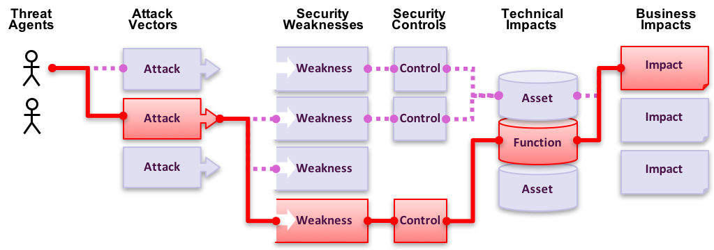

# Risco - Riscos de Segurança de Aplicações

##  O Que São os Riscos de Segurança de Aplicações?

Os atacantes podem usar potencialmente muitos caminhos diferentes através da sua aplicação para afetar o seu negócio ou organização. Cada um destes caminhos representa um risco que pode, ou não, ser suficientemente sério para requerer atenção.

Por vezes, estes caminhos são triviais de encontrar e explorar, por outras são extremamente difíceis. De forma semelhante, o dano causado pode não ter consequências, ou pode destruir o seu negócio. Para determinar o risco para a sua organização, você pode avaliar a probabilidade associada com cada agente de ameaça, vetor de ataque, e vulnerabilidades de segurança e combiná-las com a estimativa do impacto técnico e de negócio na organização.  Em conjunto, estes fatores determinam o risco global.

## Qual o meu Risco

O [OWASP Top 10](https://www.owasp.org/index.php/Top10) foca na identificação dos riscos mais graves para uma ampla gama de organizações. Para cada um desses riscos, fornecemos informações genéricas sobre probabilidade e impacto técnico usando o seguinte esquema de classificação simples, que é baseado na Metodologia de Classificação de Risco da OWASP.

| Agentes de Ameaça | Explorabilidade | Prevalência da Vulnerabilidade | Detectabilidade da Vulnerabilidade | Impactos Técnicos | Impactos de Negócio |
| -- | -- | -- | -- | -- | -- |
| Específico da Aplicação | Fácil 3 | Generalizada 3 | Fácil 3 | Severo 3 | Específicos da Aplicação/Negócio |
| Específico da Aplicação | Médio 2 | Comum 2 | Médio 2 | Moderado 2 | Específicos da Aplicação/Negócio |
| Específico da Aplicação | Difícil 1 | Pouco Comum 1 | Difícil 1 | Menor 1 | Específicos da Aplicação/Negócio |

Nesta edição, atualizamos o sistema de classificação de risco para auxiliar no cálculo da probabilidade e impacto de qualquer dado risco. Para obter mais detalhes, consulte [Nota sobre riscos](0xc0-note-about-risks.md).

Cada organização é única, e também os atores de ameaça para essa organização, seus objetivos e o impacto de qualquer violação. Se uma organização de interesse público usa um sistema de gerenciamento de conteúdo (CMS) para informações públicas e um sistema de saúde usa o mesmo CMS exato para registros de saúde sensíveis, os atores de ameaça e os impactos de negócios podem ser muito diferentes para o mesmo software. É fundamental compreender o risco para sua organização com base em agentes de ameaças aplicáveis e impactos comerciais.

Sempre que possível, os nomes dos riscos no Top 10 estão alinhados com as fraquezas [Common Weakness Enumeration](https://cwe.mitre.org/) (CWE) para promover práticas de segurança geralmente aceitas e para reduzir possíveis confusões.

## Referências

### OWASP

* [OWASP Risk Rating Methodology](https://www.owasp.org/index.php/OWASP_Risk_Rating_Methodology)
* [Article on Threat/Risk Modeling](https://www.owasp.org/index.php/Threat_Risk_Modeling)

### Externas

* [ISO 31000: Risk Management Std](https://www.iso.org/iso-31000-risk-management.html)
* [ISO 27001: ISMS](https://www.iso.org/isoiec-27001-information-security.html)
* [NIST Cyber Framework (US)](https://www.nist.gov/cyberframework)
* [ASD Strategic Mitigations (AU)](https://www.asd.gov.au/infosec/mitigationstrategies.htm)
* [NIST CVSS 3.0](https://nvd.nist.gov/vuln-metrics/cvss/v3-calculator)
* [Microsoft Threat Modelling Tool](https://www.microsoft.com/en-us/download/details.aspx?id=49168)
